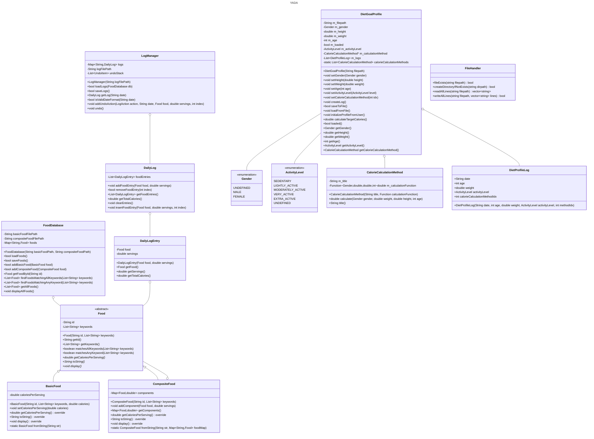

```mermaid
---
title: YADA
---
classDiagram
    class Food {
        <<abstract>>
        -String id
        -List~String~ keywords
        +Food(String id, List~String~ keywords)
        +String getId()
        +List~String~ getKeywords()
        +boolean matchesAllKeywords(List~String~ keywords)
        +boolean matchesAnyKeyword(List~String~ keywords)
        +double getCaloriesPerServing()*
        +String toString()*
        +void display()*
    }
    
    class BasicFood {
        -double caloriesPerServing
        +BasicFood(String id, List~String~ keywords, double calories)
        +void setCaloriesPerServing(double calories)
        +double getCaloriesPerServing() override
        +String toString() override
        +void display() override
        +static BasicFood fromString(String str)
    }
    
    class CompositeFood {
        -Map~Food,double~ components
        +CompositeFood(String id, List~String~ keywords)
        +void addComponent(Food food, double servings)
        +Map~Food,double~ getComponents()
        +double getCaloriesPerServing() override
        +String toString() override
        +void display() override
        +static CompositeFood fromString(String str, Map~String,Food~ foodMap)
    }
    
    class FoodDatabase {
        -String basicFoodFilePath
        -String compositeFoodFilePath
        -Map~String,Food~ foods
        +FoodDatabase(String basicFoodPath, String compositeFoodPath)
        +bool loadFoods()
        +bool saveFoods()
        +bool addBasicFood(BasicFood food)
        +bool addCompositeFood(CompositeFood food)
        +Food getFoodById(String id)
        +List~Food~ findFoodsMatchingAllKeywords(List~String~ keywords)
        +List~Food~ findFoodsMatchingAnyKeyword(List~String~ keywords)
        +List~Food~ getAllFoods()
        +void displayAllFoods()
    }
    
    class DailyLogEntry {
        -Food food
        -double servings
        +DailyLogEntry(Food food, double servings)
        +Food getFood()
        +double getServings()
        +double getTotalCalories()
    }
    
    class DailyLog {
        -List~DailyLogEntry~ foodEntries
        +void addFoodEntry(Food food, double servings)
        +bool removeFoodEntry(int index)
        +List~DailyLogEntry~ getFoodEntries()
        +double getTotalCalories()
        +void clearEntries()
        +void insertFoodEntry(Food food, double servings, int index)
    }
    
    class LogManager {
        -Map~String,DailyLog~ logs
        -String logFilePath
        -List~UndoItem~ undoStack
        +LogManager(String logFilePath)
        +bool loadLogs(FoodDatabase db)
        +bool saveLogs()
        +DailyLog getLog(String date)
        +bool isValidDateFormat(String date)
        +void addUndoAction(LogAction action, String date, Food food, double servings, int index)
        +void undo()
    }
    
    class Gender {
        <<enumeration>>
        UNDEFINED
        MALE
        FEMALE
    }
    
    class ActivityLevel {
        <<enumeration>>
        SEDENTARY
        LIGHTLY_ACTIVE
        MODERATELY_ACTIVE
        VERY_ACTIVE
        EXTRA_ACTIVE
        UNDEFINED
    }
    
    class CalorieCalculationMethod {
        -String m_title
        -Function~Gender,double,double,int~double m_calculationFunction
        +CalorieCalculationMethod(String title, Function calculationFunction)
        +double calculate(Gender gender, double weight, double height, int age)
        +String title()
    }
    
    class DietProfileLog {
        +String date
        +int age
        +double weight
        +ActivityLevel activityLevel
        +int calorieCalculationMethodIdx
        +DietProfileLog(String date, int age, double weight, ActivityLevel activityLevel, int methodIdx)
    }
    
    class DietGoalProfile {
        -String m_filepath
        -Gender m_gender
        -double m_height
        -double m_weight
        -int m_age
        -bool m_loaded
        -ActivityLevel m_activityLevel
        -CalorieCalculationMethod* m_calculationMethod
        -List~DietProfileLog~ m_logs
        -static List~CalorieCalculationMethod~ calorieCalculationMethods
        +DietGoalProfile(String filepath)
        +void setGender(Gender gender)
        +void setHeight(double height)
        +void setWeight(double weight)
        +void setAge(int age)
        +void setActivityLevel(ActivityLevel level)
        +void setCalorieCalculationMethod(int idx)
        +void createLog()
        +bool saveToFile()
        +void loadFromFile()
        +void initializeProfileFromUser()
        +double calculateTargetCalories()
        +bool loaded()
        +Gender getGender()
        +double getHeight()
        +double getWeight()
        +int getAge()
        +ActivityLevel getActivityLevel()
        +CalorieCalculationMethod getCalorieCalculationMethod()
    }

    class FileHandler {
        +fileExists(string filepath) bool
        +createDirectoryIfNotExists(string dirpath) bool
        +readAllLines(string filepath) vector~string~
        +writeAllLines(string filepath, vector~string~ lines) bool
    }

    Food <|-- BasicFood
    Food <|-- CompositeFood
    CompositeFood o-- Food
    FoodDatabase o-- Food
    DailyLog o-- DailyLogEntry
    DailyLogEntry o-- Food
    LogManager o-- DailyLog
    DietGoalProfile -- Gender
    DietGoalProfile -- ActivityLevel
    DietGoalProfile o-- CalorieCalculationMethod
    DietGoalProfile o-- DietProfileLog
```