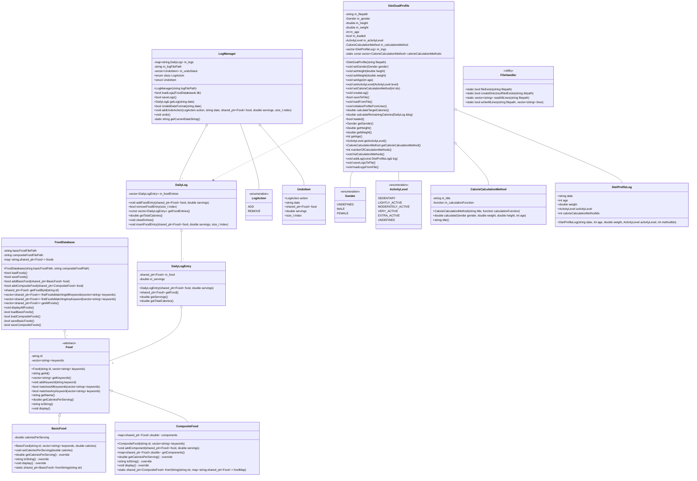

```mermaid
classDiagram
    title YADA
    class Food {
        <<abstract>>
        -string id
        -vector~string~ keywords
        +Food(string id, vector~string~ keywords)
        +string getId()
        +vector~string~ getKeywords()
        +void addKeyword(string keyword)
        +bool matchesAllKeywords(vector~string~ keywords)
        +bool matchesAnyKeyword(vector~string~ keywords)
        +string getName()
        +double getCaloriesPerServing()
        +string toString()
        +void display()
    }
    
    class BasicFood {
        -double caloriesPerServing
        +BasicFood(string id, vector~string~ keywords, double calories)
        +void setCaloriesPerServing(double calories)
        +double getCaloriesPerServing() override
        +string toString() override
        +void display() override
        +static shared_ptr~BasicFood~ fromString(string str)
    }
    
    class CompositeFood {
        -map~shared_ptr~Food~,double~ components
        +CompositeFood(string id, vector~string~ keywords)
        +void addComponent(shared_ptr~Food~ food, double servings)
        +map~shared_ptr~Food~,double~ getComponents()
        +double getCaloriesPerServing() override
        +string toString() override
        +void display() override
        +static shared_ptr~CompositeFood~ fromString(string str, map~string,shared_ptr~Food~~ foodMap)
    }
    
    class FoodDatabase {
        -string basicFoodFilePath
        -string compositeFoodFilePath
        -map~string,shared_ptr~Food~~ foods
        +FoodDatabase(string basicFoodPath, string compositeFoodPath)
        +bool loadFoods()
        +bool saveFoods()
        +bool addBasicFood(shared_ptr~BasicFood~ food)
        +bool addCompositeFood(shared_ptr~CompositeFood~ food)
        +shared_ptr~Food~ getFoodById(string id)
        +vector~shared_ptr~Food~~ findFoodsMatchingAllKeywords(vector~string~ keywords)
        +vector~shared_ptr~Food~~ findFoodsMatchingAnyKeyword(vector~string~ keywords)
        +vector~shared_ptr~Food~~ getAllFoods()
        +void displayAllFoods()
        -bool loadBasicFoods()
        -bool loadCompositeFoods()
        -bool saveBasicFoods()
        -bool saveCompositeFoods()
    }
    
    class DailyLogEntry {
        -shared_ptr~Food~ m_food
        -double m_servings
        +DailyLogEntry(shared_ptr~Food~ food, double servings)
        +shared_ptr~Food~ getFood()
        +double getServings()
        +double getTotalCalories()
    }
    
    class DailyLog {
        -vector~DailyLogEntry~ m_foodEntries
        +void addFoodEntry(shared_ptr~Food~ food, double servings)
        +bool removeFoodEntry(size_t index)
        +const vector~DailyLogEntry~ getFoodEntries()
        +double getTotalCalories()
        +void clearEntries()
        +void insertFoodEntry(shared_ptr~Food~ food, double servings, size_t index)
    }
    
    class LogManager {
        -map~string,DailyLog~ m_logs
        -string m_logFilePath
        -vector~UndoItem~ m_undoStack
        +enum class LogAction
        +struct UndoItem
        +LogManager(string logFilePath)
        +bool loadLogs(FoodDatabase& db)
        +bool saveLogs()
        +DailyLog& getLog(string date)
        +bool isValidDateFormat(string date)
        +void addUndoAction(LogAction action, string date, shared_ptr~Food~ food, double servings, size_t index)
        +void undo()
        -static string getCurrentDateString()
    }
    
    class LogAction {
        <<enumeration>>
        ADD
        REMOVE
    }
    
    class UndoItem {
        +LogAction action
        +string date
        +shared_ptr~Food~ food
        +double servings
        +size_t index
    }
    
    class Gender {
        <<enumeration>>
        UNDEFINED
        MALE
        FEMALE
    }
    
    class ActivityLevel {
        <<enumeration>>
        SEDENTARY
        LIGHTLY_ACTIVE
        MODERATELY_ACTIVE
        VERY_ACTIVE
        EXTRA_ACTIVE
        UNDEFINED
    }
    
    class CalorieCalculationMethod {
        -string m_title
        -function m_calculationFunction
        +CalorieCalculationMethod(string title, function calculationFunction)
        +double calculate(Gender gender, double weight, double height, int age)
        +string title()
    }
    
    class DietProfileLog {
        +string date
        +int age
        +double weight
        +ActivityLevel activityLevel
        +int calorieCalculationMethodIdx
        +DietProfileLog(string date, int age, double weight, ActivityLevel activityLevel, int methodIdx)
    }
    
    class DietGoalProfile {
        -string m_filepath
        -Gender m_gender
        -double m_height
        -double m_weight
        -int m_age
        -bool m_loaded
        -ActivityLevel m_activityLevel
        -CalorieCalculationMethod m_calculationMethod
        -vector~DietProfileLog~ m_logs
        -static const vector~CalorieCalculationMethod~ calorieCalculationMethods
        +DietGoalProfile(string filepath)
        +void setGender(Gender gender)
        +void setHeight(double height)
        +void setWeight(double weight)
        +void setAge(int age)
        +void setActivityLevel(ActivityLevel level)
        +void setCalorieCalculationMethod(int idx)
        +void createLog()
        +bool saveToFile()
        +void loadFromFile()
        +void initializeProfileFromUser()
        +double calculateTargetCalories()
        +double calculateRemainingCalories(DailyLog &log)
        +bool loaded()
        +Gender getGender()
        +double getHeight()
        +double getWeight()
        +int getAge()
        +ActivityLevel getActivityLevel()
        +CalorieCalculationMethod getCalorieCalculationMethod()
        +int numberOfCalculationMethods()
        +void listCalculationMethods()
        +void addLog(const DietProfileLog& log)
        +void saveLogsToFile()
        +void loadLogsFromFile()
    }

    class FileHandler {
        <<utility>>
        +static bool fileExists(string filepath)
        +static bool createDirectoryIfNotExists(string dirpath)
        +static vector~string~ readAllLines(string filepath)
        +static bool writeAllLines(string filepath, vector~string~ lines)
    }

    Food <|-- BasicFood
    Food <|-- CompositeFood
    FoodDatabase o-- "*" Food
    DailyLog o-- "*" DailyLogEntry
    DailyLogEntry o-- "1" Food
    LogManager o-- "*" DailyLog
    DietGoalProfile ..> DailyLog
    DietGoalProfile -- Gender
    DietGoalProfile -- ActivityLevel
    DietGoalProfile o-- CalorieCalculationMethod
    DietGoalProfile o-- DietProfileLog
    LogManager -- LogAction
    LogManager o-- UndoItem
```