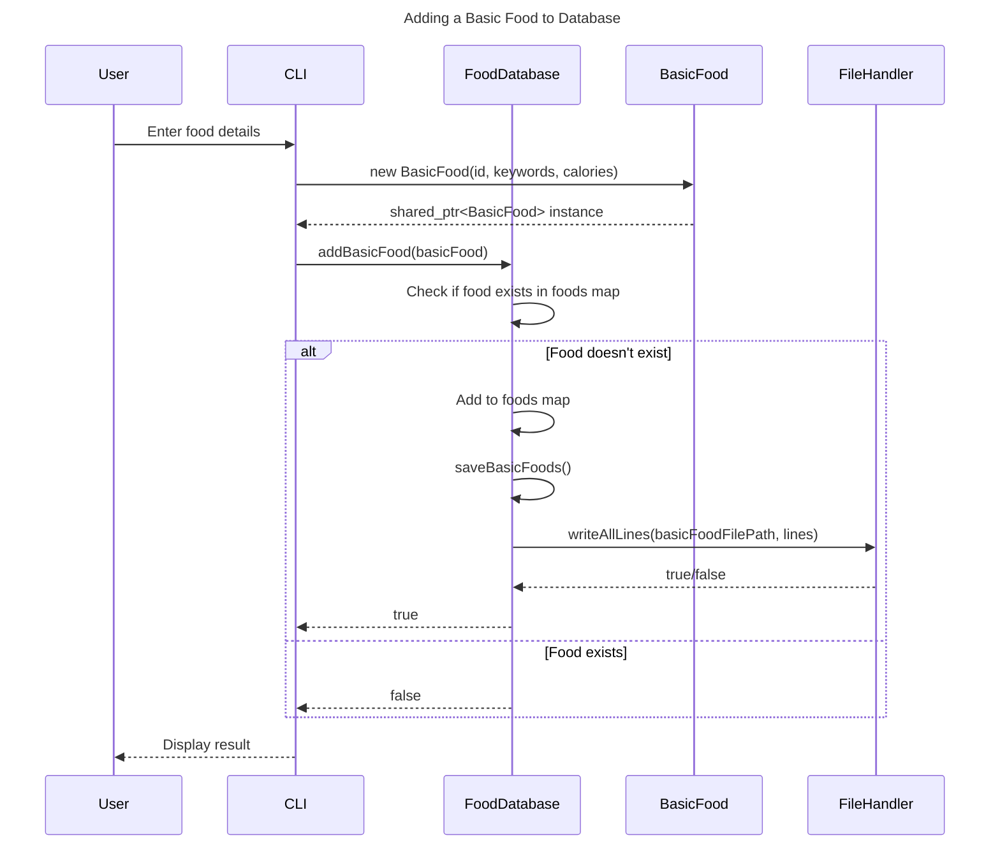
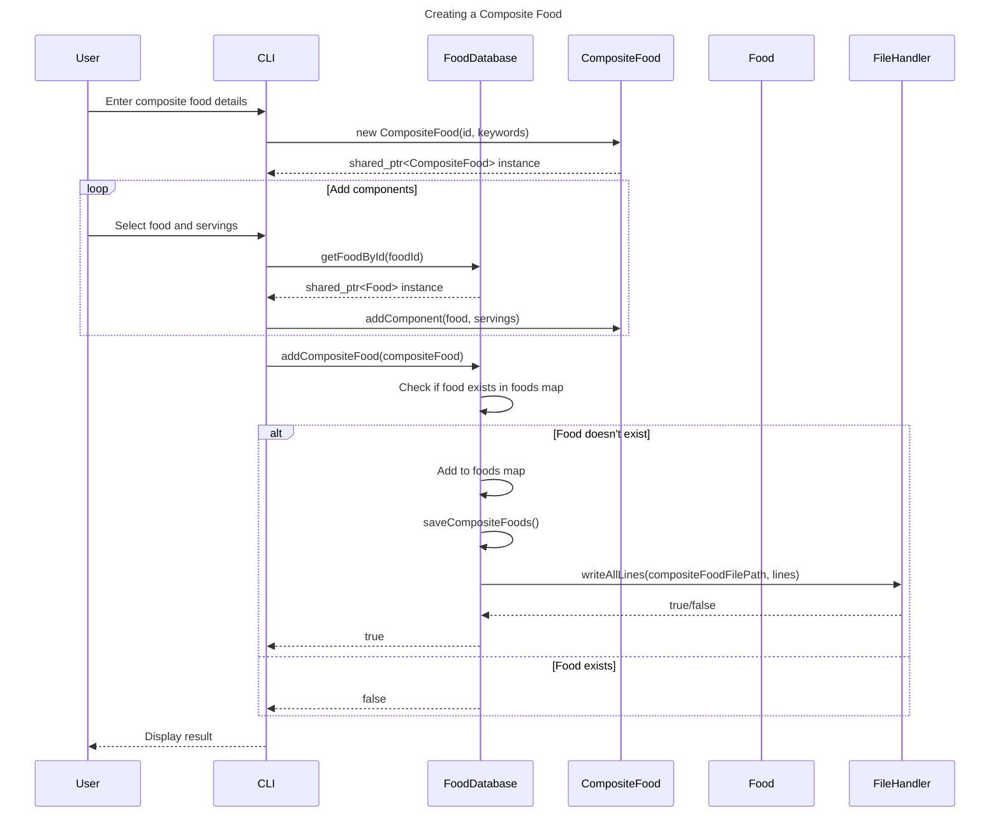
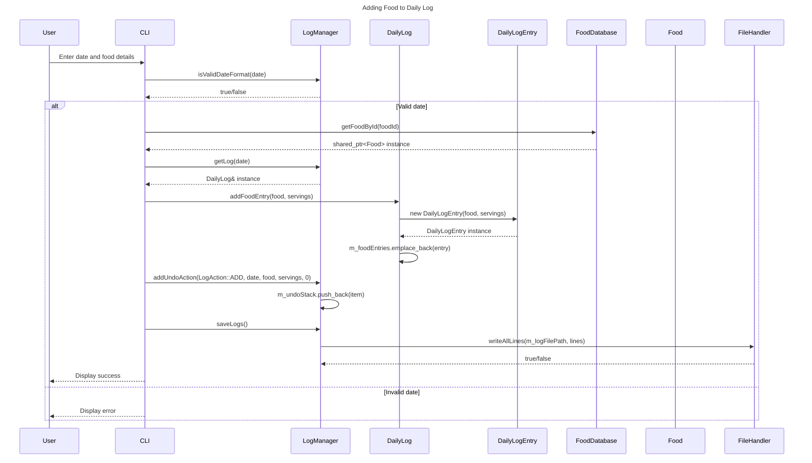
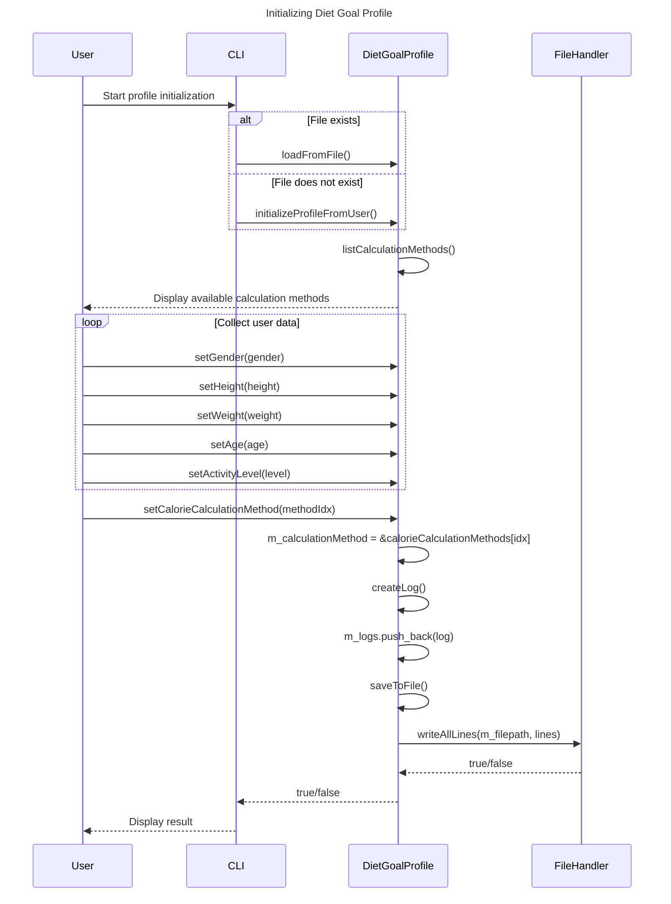
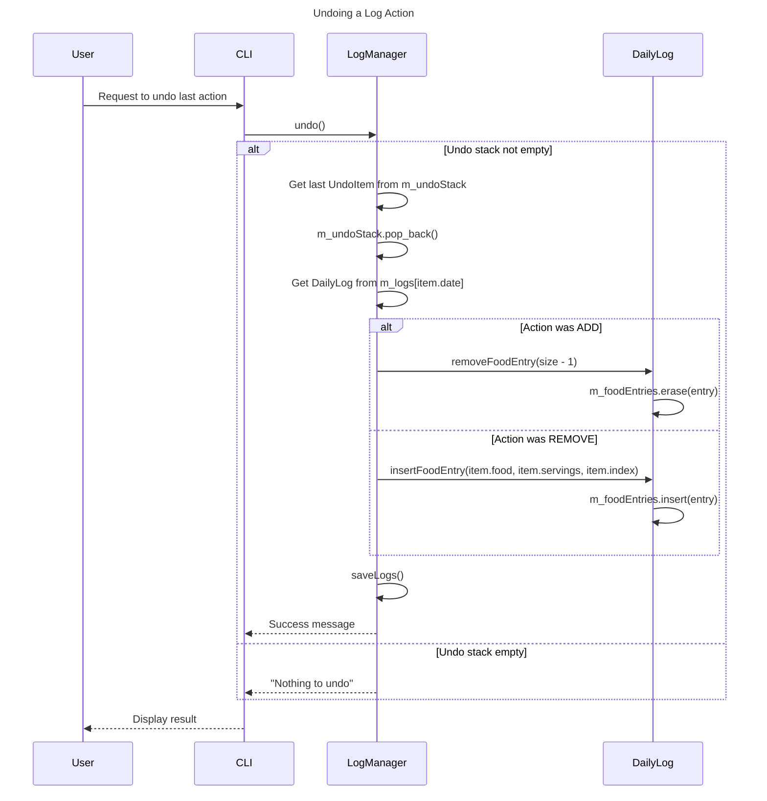

# YADA sequence diagrams

```mermaid
sequenceDiagram
    participant User
    participant CLI
    participant FoodDatabase
    participant BasicFood
    participant FileHandler

    title Adding a Basic Food to Database

    User->>CLI: Enter food details
    CLI->>BasicFood: new BasicFood(id, keywords, calories)
    BasicFood-->>CLI: shared_ptr<BasicFood> instance
    CLI->>FoodDatabase: addBasicFood(basicFood)
    FoodDatabase->>FoodDatabase: Check if food exists in foods map
    alt Food doesn't exist
        FoodDatabase->>FoodDatabase: Add to foods map
        FoodDatabase->>FoodDatabase: saveBasicFoods()
        FoodDatabase->>FileHandler: writeAllLines(basicFoodFilePath, lines)
        FileHandler-->>FoodDatabase: true/false
        FoodDatabase-->>CLI: true
    else Food exists
        FoodDatabase-->>CLI: false
    end
    CLI-->>User: Display result
```

```mermaid
sequenceDiagram
    participant User
    participant CLI
    participant FoodDatabase
    participant CompositeFood
    participant Food
    participant FileHandler

    title Creating a Composite Food

    User->>CLI: Enter composite food details
    CLI->>CompositeFood: new CompositeFood(id, keywords)
    CompositeFood-->>CLI: shared_ptr<CompositeFood> instance
    loop Add components
        User->>CLI: Select food and servings
        CLI->>FoodDatabase: getFoodById(foodId)
        FoodDatabase-->>CLI: shared_ptr<Food> instance
        CLI->>CompositeFood: addComponent(food, servings)
    end
    CLI->>FoodDatabase: addCompositeFood(compositeFood)
    FoodDatabase->>FoodDatabase: Check if food exists in foods map
    alt Food doesn't exist
        FoodDatabase->>FoodDatabase: Add to foods map
        FoodDatabase->>FoodDatabase: saveCompositeFoods()
        FoodDatabase->>FileHandler: writeAllLines(compositeFoodFilePath, lines)
        FileHandler-->>FoodDatabase: true/false
        FoodDatabase-->>CLI: true
    else Food exists
        FoodDatabase-->>CLI: false
    end
    CLI-->>User: Display result
```

```mermaid
sequenceDiagram
    participant User
    participant CLI
    participant LogManager
    participant DailyLog
    participant DailyLogEntry
    participant FoodDatabase
    participant Food

    title Adding Food to Daily Log

    User->>CLI: Enter date and food details
    CLI->>LogManager: isValidDateFormat(date)
    LogManager-->>CLI: true/false
    alt Valid date
        CLI->>FoodDatabase: getFoodById(foodId)
        FoodDatabase-->>CLI: shared_ptr<Food> instance
        CLI->>LogManager: getLog(date)
        LogManager-->>CLI: DailyLog& instance
        CLI->>DailyLog: addFoodEntry(food, servings)
        DailyLog->>DailyLogEntry: new DailyLogEntry(food, servings)
        DailyLogEntry-->>DailyLog: DailyLogEntry instance
        DailyLog->>DailyLog: m_foodEntries.emplace_back(entry)
        CLI->>LogManager: addUndoAction(LogAction::ADD, date, food, servings, 0)
        LogManager->>LogManager: m_undoStack.push_back(item)
        CLI->>LogManager: saveLogs()
        LogManager->>FileHandler: writeAllLines(m_logFilePath, lines)
        FileHandler-->>LogManager: true/false
        CLI-->>User: Display success
    else Invalid date
        CLI-->>User: Display error
    end
```

```mermaid
sequenceDiagram
    participant User
    participant CLI
    participant DietGoalProfile
    participant FileHandler

    title Initializing Diet Goal Profile

    User->>CLI: Start profile initialization
    alt File exists
        CLI->>DietGoalProfile: loadFromFile()
    else File does not exist
        CLI->>DietGoalProfile: initializeProfileFromUser()
    end
    DietGoalProfile->>DietGoalProfile: listCalculationMethods()
    DietGoalProfile-->>User: Display available calculation methods
    loop Collect user data
        User->>DietGoalProfile: setGender(gender)
        User->>DietGoalProfile: setHeight(height)
        User->>DietGoalProfile: setWeight(weight)
        User->>DietGoalProfile: setAge(age)
        User->>DietGoalProfile: setActivityLevel(level)
    end
    User->>DietGoalProfile: setCalorieCalculationMethod(methodIdx)
    DietGoalProfile->>DietGoalProfile: m_calculationMethod = &calorieCalculationMethods[idx]
    DietGoalProfile->>DietGoalProfile: createLog()
    DietGoalProfile->>DietGoalProfile: m_logs.push_back(log)
    DietGoalProfile->>DietGoalProfile: saveToFile()
    DietGoalProfile->>FileHandler: writeAllLines(m_filepath, lines)
    FileHandler-->>DietGoalProfile: true/false
    DietGoalProfile-->>CLI: true/false
    CLI-->>User: Display result
```

```mermaid
sequenceDiagram
    participant User
    participant CLI
    participant LogManager
    participant DailyLog

    title Undoing a Log Action

    User->>CLI: Request to undo last action
    CLI->>LogManager: undo()
    alt Undo stack not empty
        LogManager->>LogManager: Get last UndoItem from m_undoStack
        LogManager->>LogManager: m_undoStack.pop_back()
        LogManager->>LogManager: Get DailyLog from m_logs[item.date]
        alt Action was ADD
            LogManager->>DailyLog: removeFoodEntry(size - 1)
            DailyLog->>DailyLog: m_foodEntries.erase(entry)
        else Action was REMOVE
            LogManager->>DailyLog: insertFoodEntry(item.food, item.servings, item.index)
            DailyLog->>DailyLog: m_foodEntries.insert(entry)
        end
        LogManager->>LogManager: saveLogs()
        LogManager-->>CLI: Success message
    else Undo stack empty
        LogManager-->>CLI: "Nothing to undo"
    end
    CLI-->>User: Display result
```