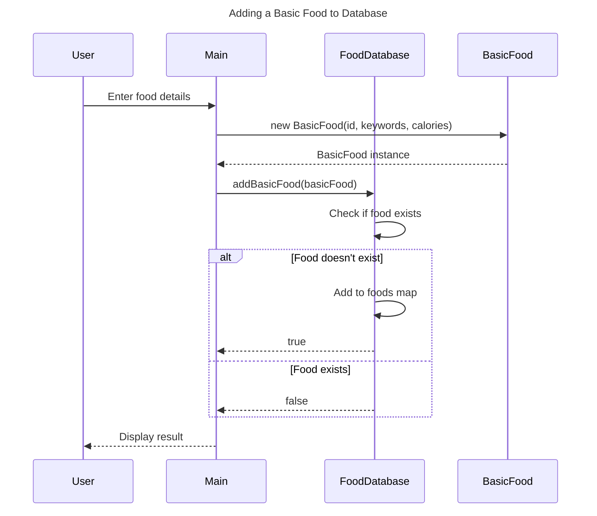
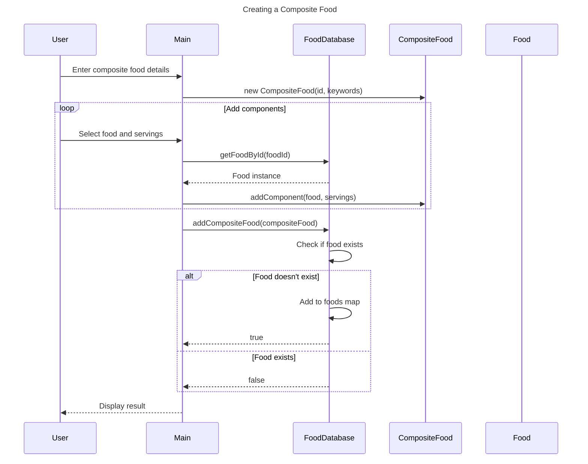
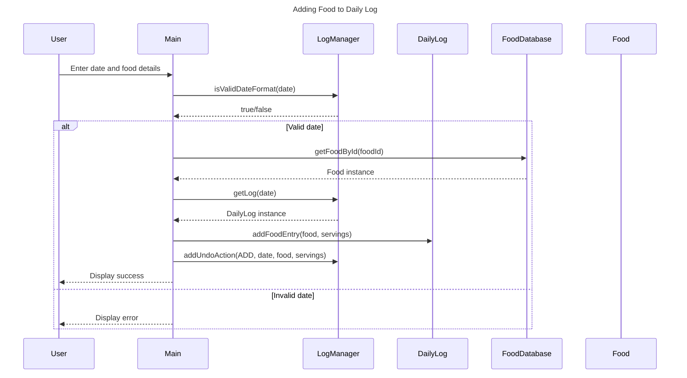
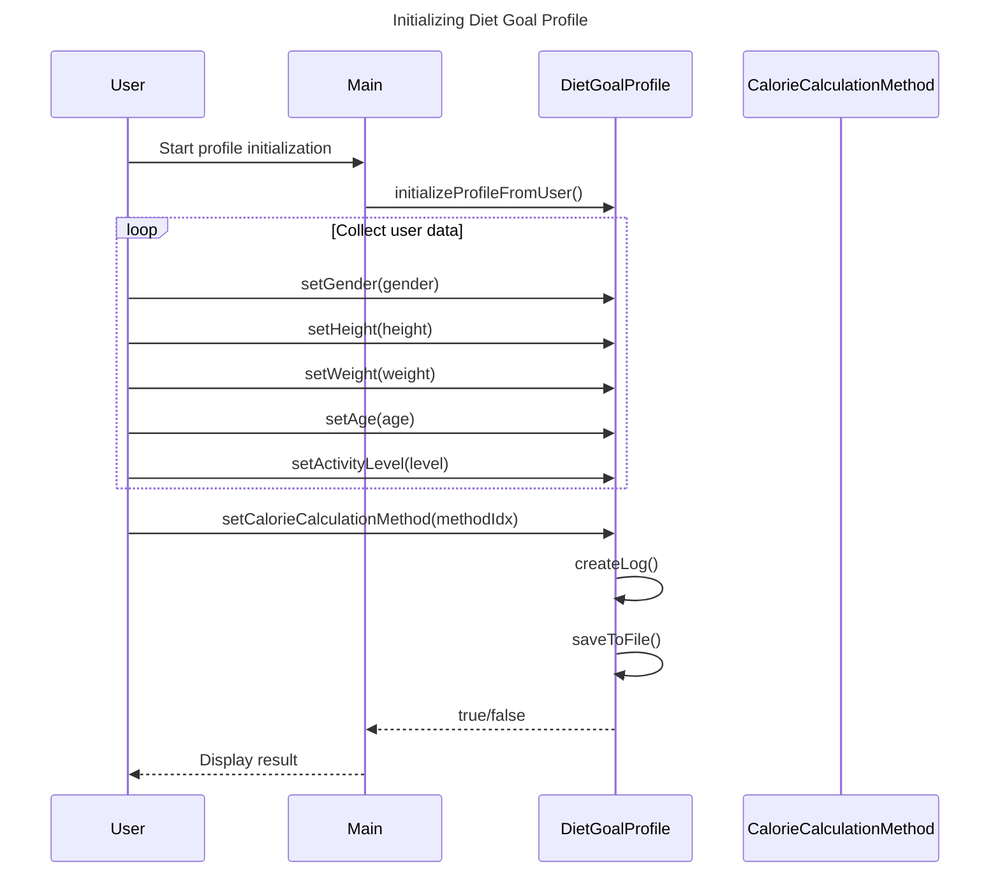

# YADA sequence diagrams

```mermaid
sequenceDiagram
    participant User
    participant Main
    participant FoodDatabase
    participant BasicFood

    title Adding a Basic Food to Database

    User->>Main: Enter food details
    Main->>BasicFood: new BasicFood(id, keywords, calories)
    BasicFood-->>Main: BasicFood instance
    Main->>FoodDatabase: addBasicFood(basicFood)
    FoodDatabase->>FoodDatabase: Check if food exists
    alt Food doesn't exist
        FoodDatabase->>FoodDatabase: Add to foods map
        FoodDatabase-->>Main: true
    else Food exists
        FoodDatabase-->>Main: false
    end
    Main-->>User: Display result
```

```mermaid
sequenceDiagram
    participant User
    participant Main
    participant FoodDatabase
    participant CompositeFood
    participant Food

    title Creating a Composite Food

    User->>Main: Enter composite food details
    Main->>CompositeFood: new CompositeFood(id, keywords)
    loop Add components
        User->>Main: Select food and servings
        Main->>FoodDatabase: getFoodById(foodId)
        FoodDatabase-->>Main: Food instance
        Main->>CompositeFood: addComponent(food, servings)
    end
    Main->>FoodDatabase: addCompositeFood(compositeFood)
    FoodDatabase->>FoodDatabase: Check if food exists
    alt Food doesn't exist
        FoodDatabase->>FoodDatabase: Add to foods map
        FoodDatabase-->>Main: true
    else Food exists
        FoodDatabase-->>Main: false
    end
    Main-->>User: Display result
```

```mermaid
sequenceDiagram
    participant User
    participant Main
    participant LogManager
    participant DailyLog
    participant FoodDatabase
    participant Food

    title Adding Food to Daily Log

    User->>Main: Enter date and food details
    Main->>LogManager: isValidDateFormat(date)
    LogManager-->>Main: true/false
    alt Valid date
        Main->>FoodDatabase: getFoodById(foodId)
        FoodDatabase-->>Main: Food instance
        Main->>LogManager: getLog(date)
        LogManager-->>Main: DailyLog instance
        Main->>DailyLog: addFoodEntry(food, servings)
        Main->>LogManager: addUndoAction(ADD, date, food, servings)
        Main-->>User: Display success
    else Invalid date
        Main-->>User: Display error
    end
```

```mermaid
sequenceDiagram
    participant User
    participant Main
    participant DietGoalProfile
    participant CalorieCalculationMethod

    title Initializing Diet Goal Profile

    User->>Main: Start profile initialization
    Main->>DietGoalProfile: initializeProfileFromUser()
    loop Collect user data
        User->>DietGoalProfile: setGender(gender)
        User->>DietGoalProfile: setHeight(height)
        User->>DietGoalProfile: setWeight(weight)
        User->>DietGoalProfile: setAge(age)
        User->>DietGoalProfile: setActivityLevel(level)
    end
    User->>DietGoalProfile: setCalorieCalculationMethod(methodIdx)
    DietGoalProfile->>DietGoalProfile: createLog()
    DietGoalProfile->>DietGoalProfile: saveToFile()
    DietGoalProfile-->>Main: true/false
    Main-->>User: Display result
```