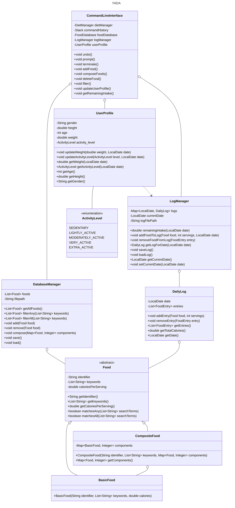

```mermaid
---
title: YADA
---
classDiagram
    class Food {
        <<abstract>>
        -String identifier
        -List~String~ keywords
        -double caloriesPerServing
        +String getIdentifier()
        +List~String~ getKeywords()
        +double getCaloriesPerServing()
        +boolean matchesAny(List~String~ searchTerms)
        +boolean matchesAll(List~String~ searchTerms)
    }
    
    class BasicFood {
        +BasicFood(String identifier, List~String~ keywords, double calories)
    }
    
    class CompositeFood {
        -Map~BasicFood, Integer~ components
        +CompositeFood(String identifier, List~String~ keywords, Map~Food, Integer~ components)
        +Map~Food, Integer~ getComponents()
    }
    
    class DatabaseManager {
        -List~Food~ foods
        -String filepath
        +List~Food~ getAllFoods()
        +List~Food~ filterAny(List~String~ keywords)
        +List~Food~ filterAll(List~String~ keywords)
        +void add(Food food)
        +void remove(Food food)
        +void compose(Map~Food, Integer~ components)
        +void save()
        +void load()
    }
    
    class DailyLog {
        -LocalDate date
        -List~FoodEntry~ entries
        +void addEntry(Food food, int servings)
        +void removeEntry(FoodEntry entry)
        +List~FoodEntry~ getEntries()
        +double getTotalCalories()
        +LocalDate getDate()
    }
    
    class LogManager {
        -Map~LocalDate, DailyLog~ logs
        -LocalDate currentDate
        -String logFilePath
        +double remainingIntake(LocalDate date)
        +void addFoodToLog(Food food, int servings, LocalDate date)
        +void removeFoodFromLog(FoodEntry entry)
        +DailyLog getLogForDate(LocalDate date)
        +void saveLog()
        +void loadLog()
        +LocalDate getCurrentDate()
        +void setCurrentDate(LocalDate date)
    }
    
    class UserProfile {
        -String gender
        -double height
        -int age
        -double weight
        -ActivityLevel activity_level
        +void updateWeight(double weight, LocalDate date)
        +void updateActivityLevel(ActivityLevel level, LocalDate date)
        +double getWeight(LocalDate date)
        +ActivityLevel getActivityLevel(LocalDate date)
        +int getAge()
        +double getHeight()
        +String getGender()
    }
    
    class ActivityLevel {
        <<enumeration>>
        SEDENTARY
        LIGHTLY_ACTIVE
        MODERATELY_ACTIVE
        VERY_ACTIVE
        EXTRA_ACTIVE
    }
    
    class CommandLineInterface {
        -DietManager dietManager
        -Stack commandHistory
        -FoodDatabase foodDatabase
        -LogManager logManager
        -UserProfile userProfile
        +void undo()
        +void prompt()
        +void terminate()
        +void addFood()
        +void composeFoods()
        +void deleteFood()
        +void filter()
        +void updateUserProfile()
        +void getRemainingIntake()
    }

    Food <|-- BasicFood
    Food <|-- CompositeFood
    CompositeFood o-- BasicFood
    DatabaseManager o-- Food
    DailyLog o-- Food
    LogManager o-- DailyLog
    UserProfile -- ActivityLevel
    UserProfile ..> LogManager
    CommandLineInterface o-- DatabaseManager
    CommandLineInterface o-- LogManager
    CommandLineInterface o-- UserProfile

```